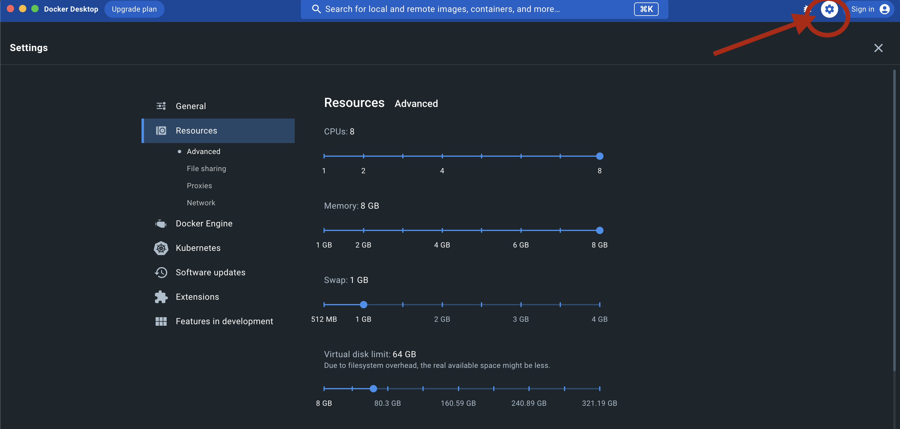

<!-- This was used to load seed data from kaggle data set, for loading seed data use the neo4j.dump instead-->

# Install Docker

[Download](https://www.docker.com/products/docker-desktop/ 'Download Docker') docker
For local development use docker desktop application as it is easier to manage

# Below command create a container for neo4j db

```sh
# open terminal/VS code in project folder
cd my_project_foler/RPG;

# run the command inside your project folder
# For developers
docker run \
    --user $(id -u):$(id -g) \
    -p 7474:7474 -p 7687:7687 \
    -v $PWD/neo4j/data:/data -v $PWD/neo4j/plugins:/plugins -v $PWD/neo4j/import:/import \
    --name web2-project-RPG-database \
    --env NEO4J_AUTH=neo4j/helloworld \
    -e apoc.export.file.enabled=true \
    -e apoc.import.file.enabled=true \
    -e apoc.import.file.use_neo4j_config=true \
    -e NEO4J_PLUGINS=\[\"apoc\"\] \
    -d \
    neo4j:latest

# For Production
docker build -t cs554/neo4j .

docker build -t cs554/neo4j .
docker run -d \
-v $PWD/data:/data \
-p 7474:7474 -p 7687:7687 \
--name web2-project-RPG-database \
cs554/neo4j
    


# mac "apple" chip
# Do not use neo4j with docker on mac OS as it has performance issue, download neo4j desktop app instead
docker run \
    --user $(id -u):$(id -g) \
    -p 7474:7474 -p 7687:7687 \
    -v $PWD/neo4j/data:/data -v $PWD/neo4j/plugins:/plugins -v $PWD/neo4j/import:/import \
    --name web2-project-RPG-database \
    --env NEO4J_AUTH=neo4j/helloworld \
    -e apoc.export.file.enabled=true \
    -e apoc.import.file.enabled=true \
    -e apoc.import.file.use_neo4j_config=true \
    -e NEO4J_PLUGINS=\[\"apoc\"\] \
    --platform linux/amd64 \
    -d \
    neo4j:latest

# expected output:
"Remote interface available at http://localhost:7474/"
```

GOTO Docker Desktop -> Settings -> Resources -> Advanced <br>
give max CPU and memory


# import data

[Download](https://www.kaggle.com/datasets/mathurinache/citation-network-dataset 'Download Seed') seed data file and place it in the root folder of project where there is seed.js file
run seed.js
(it can take upto 1-2 hours to load 12GB of data)
